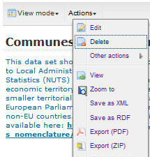

.. _index.rst:

User Manual v\ |release|
==========================

Welcome to the GeoNetwork User Manual v\ |release|. The manual is a guide describing how to use the metadata catalog.

..figure:: splash.jpg

Beginners Guide to Geonetwork
=============================

.. | atom | image:: atom.png
        :width: 20px
        :height: 20px
.. | changedate | image:: changedate.png

Explore and Visualise
---------------------
Claire has no knowledge of any Geographic information data but has seen a nice map in a presentation about population. She wants to look at it a second time. She comes to the Geoportal of the European Commission and has logged in with her ECAS account (see<< Login>> at the top right).
She clicks on <<Search Catalog>> (top left) and enters the term Population density in the Search Box and clicks on the Magnifying Glass |lensinline|. Claire is provided with a list of datasets in the right hand column. She realises that the list is quite long and wants to restrict her search only to data from one organisation. Therefore she clicks on the left hand side on an organisation e.g. European Commission, Eurostat (GISCO), which limits her search. 
After she has studied the Titles and Abstract, Claire wants to see one specific map. Claire clicks on the Green Plus sign |plusinline| followed by the Add button |addinline | which then displays the Population Density Map in the Map Viewer. After she has looked at the map, she wants to look at another dataset, for that she clicks on the <<Search Results>>  

Explore and get the data
------------------------
Pedro has been asked by his boss to create a new map of Europe showing the Statistical Units from the last year in the European Commission.  After logging in, he clicks on <<Search Catalog>> (top left) and enters the term NUTS in the Search Box and clicks on the Magnifying Lens |lensinline|.  As he wants a quick visual overview of the latest records he decided to change the sorting based on date and show only the titles and thumbnails instead of the records with abstracts. | changedate |  
Pedro noticed the rectangle in the Map viewer gets highlighted depending on the selected metadata record. After he has identified one dataset, he clicks on the blue arrow |otherinfo| to see any related information, e.g. for database connection information, download, etc.. 
Certain records also have a specified Atom download service |atom| associated with the data, which Pedro can click on to receive data directly to his desk. 

Edit Metadata records
---------------------
Marie has been asked to modify an existing metadata record which she or her group previously created.  She logged in with her ECAS account (see<< Login>> at the top right). First she checks if the metadata record still exists the <<My Data>> category.  She clicks on the record to see the full details. As she owns the dataset, she is allowed to <<EDIT>> the metadata record under the <<Actions>> menu. 

After finishing all her editing, she saves the record and Exports it as Zip file to send it to her colleague Claire.  

Further documentation can be found in the other documents:

`GeoNetwork User Manual (PDF) <GeoNetworkUserManual.pdf>`_

.. toctree::
    :maxdepth: 1

    quickstartguide/index.rst
    
.. toctree::
    :maxdepth: 1
    
    managing_metadata/templates/index.rst
    managing_metadata/ownership/index.rst
    managing_metadata/import/index.rst
    managing_metadata/export/index.rst
    managing_metadata/status/index.rst
    managing_metadata/versioning/index.rst
    managing_metadata/harvesting/index.rst

.. toctree::
    :maxdepth: 1
    
    appendix/glossary_of_metadata/index.rst
    appendix/iso_topic_categories/index.rst
    faq.rst
    glossary.rst   
